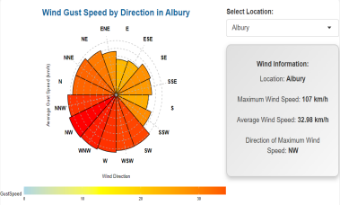

# R-shiny

# Australia Climate Dashboard

## Overview
The **Australia Climate Dashboard** provides a detailed analysis of the climate across various regions in Australia from 2007 to 2017. It includes modules focusing on **Temperature**, **Rainfall**, **Wind Speed**, and an **Exploration** panel that enables users to explore relationships between variables like temperature, humidity, wind speed, and rainfall. An **About** module summarizes the application's functionality and data sources.

---

## Modules Overview

### **1. Temperature Module**
- Displays temperature trends over a year for selected cities using a **ridge plot**.
- A **color gradient** (blue to red) is used to visualize temperature changes, making it easy to identify extreme years.
- **Interactive features**:
  - Switch cities to explore temperature trends in different regions.
  - Click on the "mountain" for specific years to view:
    - Maximum temperature.
    - Minimum temperature.
    - Comparison with historical averages.
   
    - 

---

### **2. Rainfall Module**
- An **interactive map** visualizes rainfall across Australian cities using:
  - **Color gradients** and **circular markers** to indicate rainfall intensity.
  - A **slider** allows users to adjust the year range.
- **Interactive features**:
  - Click on city markers to view detailed rainfall data.
  - Explore rainfall distribution for specific locations through a bar graph.
- The design helps users quickly identify areas with heavy rainfall and retrieve detailed data effortlessly.

---

### **3. Wind Module**
- A **polar histogram** illustrates the relationship between wind speed and direction.
  - Wind direction (ring classification data) is displayed as a circular chart.
  - Wind speed is represented through the length and color of histogram bars.
- **Interactive features**:
  - View maximum, average, and historical wind speed for selected regions.
  - Click on specific wind directions to explore historical wind speeds across years.

---

### **4. Exploration Module**
#### **Temperature VS Humidity**
- Sidebar houses navigation and filtering options.
- Main content dynamically displays **visualizations** and **data tables**.
- **Responsive design** ensures usability across different devices and screen sizes.

#### **Wind Speed VS Rainfall**
- **Scatter plot** visualizes the correlation between wind speed and rainfall (both continuous data).
- **Additional features**:
  - **Color classification** (e.g., humidity at 9 a.m. or 3 p.m.) reveals complex relationships between variables.
  - Provides a comprehensive view of the interplay between wind speed, rainfall, and humidity.

---

### **5. About Module**
- Introduces the dashboard’s functionalities and explains how to use the application.
- Provides information on the source dataset and allows users to search/query data directly.

---

## Data Sources
### Kaggle Datasets: [Australian Weather Dataset](https://www.kaggle.com/datasets/jsphyg/weather-dataset-rattle-package)
- **Provider**: Bureau of Meteorology, Commonwealth of Australia
- **Content**: 
  - ~10 years of daily weather observations across various Australian locations.
  - Includes variables such as temperature, rainfall, humidity, and wind speed.

### Bureau of Meteorology: [Official Climate Data](http://www.bom.gov.au/climate/data)
- **Usage**: 
  - Analyze weather trends.
  - Build rainfall prediction models.
  - Explore relationships between various weather variables.

---

## How to Use
1. Explore each module to gain insights into Australian weather patterns.
2. Use interactive features (clickable charts, filters, sliders) for detailed data exploration.
3. Refer to the **About Module** for additional context and dataset queries.

---

## Screenshots

#中文版

# 澳大利亚气候仪表盘

## 概览
**澳大利亚气候仪表盘** 提供了对澳大利亚多个地区从 2007 年到 2017 年的气候详细分析。包括 **温度**、**降雨量** 和 **风速** 模块，以及一个用于探索变量关系（如温度与湿度、风速与降雨量）的 **探索面板**。此外，还有一个 **关于模块** 简介仪表盘功能和数据来源。

---

## 模块简介

### **1. 温度模块**
- 通过 **山峦图（ridge plot）** 显示所选城市一年内的温度趋势。
- 使用 **颜色梯度**（蓝到红）可视化温度变化，帮助快速识别极端年份的温度差异。
- **交互功能**：
  - 切换城市，探索不同地区的温度趋势。
  - 点击特定年份的“山峰”，查看：
    - 最高温度。
    - 最低温度。
    - 与历史平均值的对比。

---

### **2. 降雨量模块**
- 通过 **交互式地图** 显示澳大利亚各城市的降雨情况：
  - **颜色梯度** 和 **圆形标记** 表示降雨量的大小。
  - 使用 **滑块** 限制年份范围。
- **交互功能**：
  - 点击城市标记查看具体降雨数据。
  - 查看特定位置的降雨分布柱状图。
- 帮助用户快速识别降雨量大的地区，并通过简单操作获取详细信息。

---

### **3. 风速模块**
- 使用 **极坐标直方图（polar histogram）** 展示风速和风向的关系：
  - 风向（环状分类数据）以圆形图展示。
  - 风速通过柱状图的长度和颜色表示。
- **交互功能**：
  - 查看所选区域的最大风速、平均风速和历史风速。
  - 点击特定风向，探索该方向不同年份的风速变化。

---

### **4. 探索模块**
#### **温度 VS 湿度**
- 侧边栏提供导航和筛选选项。
- 主内容动态显示 **可视化图表** 和 **数据表**。
- **响应式设计** 确保在不同设备和屏幕尺寸下都能正常显示。

#### **风速 VS 降雨量**
- 使用 **散点图** 显示风速与降雨量之间的相关性（连续数据）。
- **附加功能**：
  - 通过 **颜色分类** 显示湿度（例如上午 9 点或下午 3 点湿度），揭示复杂的变量关系。
  - 提供风速、降雨量和湿度之间的全面关联分析。

---

### **5. 关于模块**
- 简介仪表盘功能，并说明其使用方法。
- 提供数据来源信息，并允许用户直接查询/搜索数据。

---

## 数据来源
### Kaggle 数据集: [澳大利亚天气数据集](https://www.kaggle.com/datasets/jsphyg/weather-dataset-rattle-package)
- **提供者**: 澳大利亚联邦气象局（Bureau of Meteorology, Commonwealth of Australia）
- **内容**:
  - 提供约 10 年的澳大利亚多个地区的每日天气观测数据。
  - 包括温度、降雨量、湿度和风速等变量。

### 澳大利亚气象局: [官方气候数据](http://www.bom.gov.au/climate/data)
- **用途**:
  - 分析天气趋势。
  - 构建降雨量预测模型。
  - 探索各天气变量之间的关系。

---

## 如何使用
1. 探索每个模块，了解澳大利亚的天气模式。
2. 使用交互功能（可点击图表、筛选器、滑块）进行详细数据探索。
3. 在 **关于模块** 中查看更多背景信息和数据查询方式。

---

